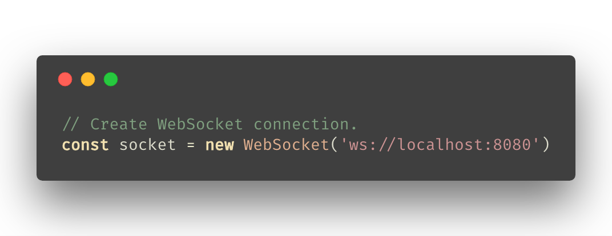
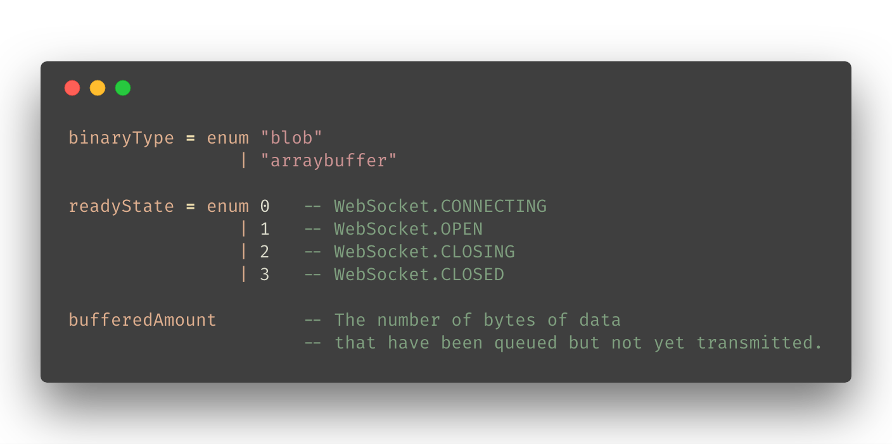
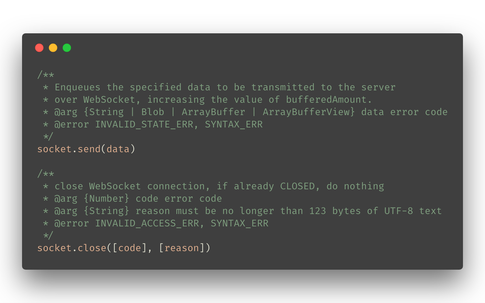
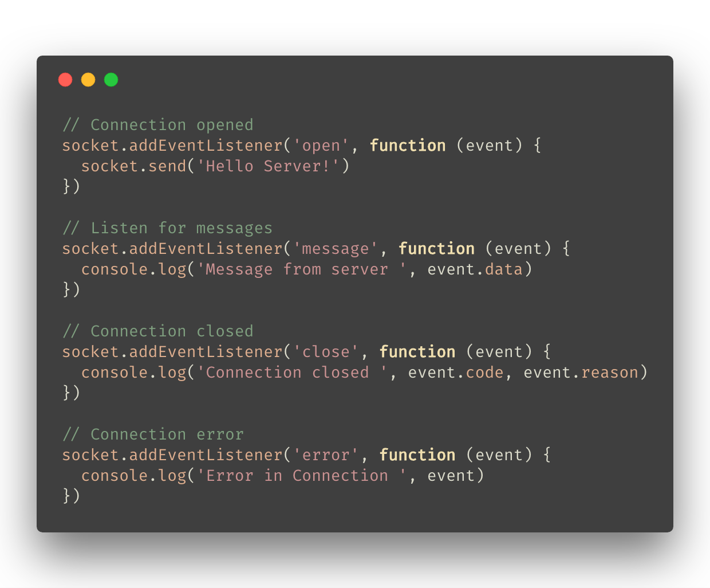
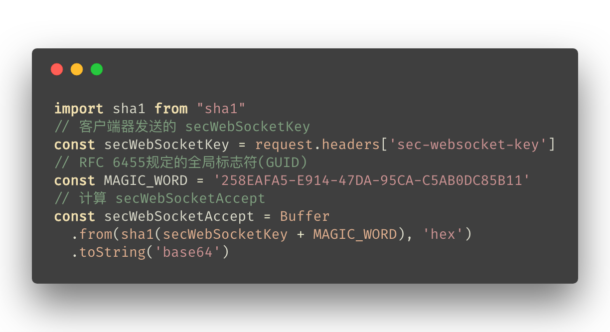
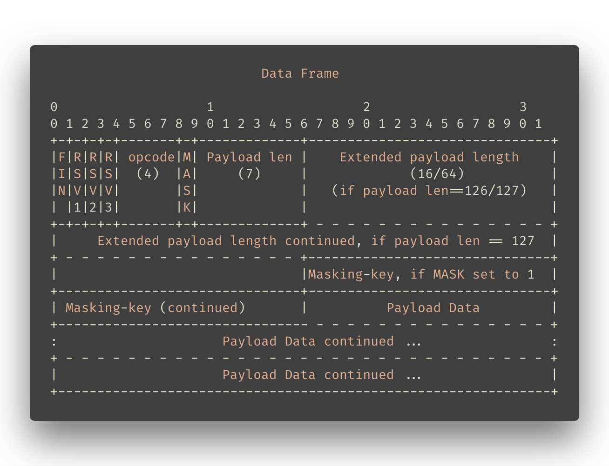

# WebSocket

<small>[AchillesG](https://github.com/Achilles)</small>

👉

## 为什么需要 WebSocket

- 金融证券的实时信息

- 社交网络的实时消息推送

- Web 导航应用中的地理位置获取

📝 场景：分析具体场景对应的不足

补充：后端处理时间很长的情况

👇

### HTTP 暴露的不足之处

- 无法做到消息的“实时性”

- ***服务端无法主动推送信息***

📝 核心：http 协议的被动性

👇

### WebSocket 前的解决方案

- Adobe®️ Flash®️ Socket
- AJAX long polling
- AJAX multipart streaming
- Forever Iframe
- JSONP Polling

📝
Socket.IO 降级方案

- flash 有自己的soket实现。在h5之前，flash使用率很高，不失为一种解决方案；现在，只在pc端还有一定市场，移动端已经gg

- polling：轮询，ajax 有短连接和长连接之分，对应到 polling 也有长短之分，最大的弊端是对服务器压力较大，cpu，内存，带宽开销都很大（http 头很大）。

  - long polling：长轮询，keep-alive，holding住连接等处理完再返回
  - short polling：短轮询，定时向服务端请求。

- streaming：通过设置 `Transfer-Encoding: chunked`，将数据分段传输

- iframe，jsonp的原理和跨域差不多，利用src，保持长链接，通过执行返回的js方法拿到数据

- iframe：不需要轮询，利用 http 的增量传输渲染功能，通过 iframe 增量接受数据

👉

## WebSocket 是什么

> <small>WebSocket 是 HTML5 提出的一种网络协议，于2011年被IETF定为标准 [RFC 6455](https://tools.ietf.org/html/rfc6455)，同年 WebSocket API 被 W3C 定为标准。</small>

- <p class="fragment">
  <small>WebSocket 协议的目标是提供一种 **机制**，使得需要和服务器双向通信的客户端应用不再依赖打开多个 HTTP 连接。</small>
</p>
<!-- .element: style="text-align: left" -->

- <p class="fragment">
  <small>WebSocket 约定通过握手机制，客户端和服务端之间能够建立一个类似 tcp 的连接，从而可以直接互相传送数据。</small>
</p>
<!-- .element: style="text-align: left" -->

👉

## WebSocket 的特点

")
<!-- .element: style="width:80%; background-color: #ddd; border: 4px solid #fff;" -->
<small>全双工通信 (full-duplex)</small>

📝 全双工通信(full-duplex)

可以结合图片解释一下 polling

👇

<ol style="font-size: 0.8em">
  <li><p>[建立在 TCP 协议基础之上，和 HTTP 协议同属于应用层](#/3/2)</p></li>
  <li><p>握手阶段采用 HTTP 协议，默认端口是 80 和 443</p></li>
  <li><p>数据格式比较轻量，性能开销小，通信高效</p></li>
  <li><p>可以发送文本，也可以发送二进制数据</p></li>
  <li><p>没有同源限制，客户端可以与任意服务器通信</p></li>
  <li><p>协议标识符是 ws(s)，`ws(s)://example.com:80/some/path`</p></li>
</ol>

📝
1. 服务器端实现容易
2. 与 HTTP 兼容性很好，不容易被屏蔽，可以共用 HTTP 的代理
3. 协议在设计是就遵循最小帧理念

👇

[](#/3/1)

👉

## WebSocket 适用场景

1. 高频率低延迟的场景
  - 股票实时价格，k线图，游戏多玩家互动等
2. 适合服务端推送数据的场景
  - 如：后端处理时间很长，异步行为等
3. 社交IM类场景，如：webQQ，webWeixin
4. 协同编辑场景，如：teambition
5. 数据打点，基于位置的应用，多媒体聊天，在线教育等

👉

## WebSocket 的使用
### —— 客户端

兼容性：
[SockJS](https://github.com/sockjs/sockjs-client#supported-transports-by-browser-html-served-from-http-or-https),
[Can I use](https://caniuse.com/#feat=websockets)


<!-- .element: style="margin-top: -50px;" -->

📝 interface: WebSocket 是与服务端连接的主接口，连接后也通过它进行数据的发送接收

👇



📝 WebSocket 实例的部分属性

- **binaryType** 设置 WebSocket 信息的具体类型

- **readyState** WebSocket 连接的状态

- **bufferedAmount** 队列中未发送数据的字节数

👇


<!-- .element: style="width: 80%" -->

📝 2 个实例方法

- send 方法将需要发送的数据加入到发送队列，同时增加 bufferedAmount 的数值。
  - *INVALID_STATE_ERR* 连接的 readyState 当前不是 OPEN
- close 方法会关闭 WebSocket 连接，如果连接状态已经 CLOSED, 方法不过任何事
  - *INVALID_ACCESS_ERR* 无效的code
  - *SYNTAX_ERR* reason 太长

👇


<!-- .element: style="width: 80%" -->

📝 4 种监听事件

其中 MessageEvent 和 CloseEvent 比较特殊：

- MessageEvent 和 Window.postMessage() and Window.onmessage 中的一致，有 data(主要数据部分), origin, source, port 等连接信息
- CloseEvent 是 WebSocket 独有，有 code, reason 等属性。其中 code 根据规范预定义了一部分，可以自定义 4000-4999 部分 code 含义。

👉

## WebSocket 的使用
### —— 服务端

<br>

WebSocket 在大部分语言都有实现,

包括 JAVA, Python, C++, node.js 等

[µWebSockets](https://github.com/uWebSockets/uWebSockets),
[Socket.IO](https://socket.io/),
[ws](https://github.com/websockets/ws)

📝
3 个 node 平台可用的库

- µWebSockets 是一个高性能，高可扩展性的库 C++11, node.js
- Socket.IO 高可用，有完备的降级方案 node.js
- ws 更为轻量化的库
---
- 一般8核16G服务器 可维持50-100万级别的长连接（每分钟广播数据）

- 浏览器端并发限制 chrome 设为 255，比常规 http 并发大很多。

- 结合本次开发经验介绍，包括前端和后端，后端的框架、自己实现，开发成本

👉

## WebSocket 进阶
### 深入协议细节

[RFC 6455](https://tools.ietf.org/html/rfc6455)

[handshake 握手](#/7) &nbsp;&nbsp; [data transfer 数据传输](#/8)

📝
文档内容主要包含两块： handshake 握手， data transfer 数据传输

👉

## Handshake 握手

[Opening Handshake](#/7/1)

[Closing Handshake](#/7/4)

👇

### Opening Handshake

client

```
GET /chat HTTP/1.1
Host: server.example.com
Upgrade: websocket
Connection: Upgrade
Sec-WebSocket-Key: dGhlIHNhbXBsZSBub25jZQ==
Origin: http://example.com
Sec-WebSocket-Protocol: chat, superchat
Sec-WebSocket-Version: 13
```

<ul style="font-size: 0.8em">
  <li><p>Upgrade, Connection: 表明升级到 WebSocket 协议</p></li>
  <li><p>Sec-WebSocket-Key: 浏览器随机生成Base64编码值，验证用</p></li>
  <li><p>Sec-WebSocket-Protocol: 标识用户自定义协议名</p></li>
  <li><p>Sec-WebSocket-Version: 使用的 WebSocket 协议版本 (13)</p></li>
</ul>

📝 可以看出 WebSocket 握手其实是一个 HTTP 请求，在请求中要求升级成 WebSocket 协议。正是因为是一个 HTTP 请求，可以携带任意 HTTP 头，包括 Cookie，于是可以在握手阶段通过请求头进行安全限制、权限检查等。

👇

server

```
HTTP/1.1 101 Switching Protocols
Upgrade: websocket
Connection: Upgrade
Sec-WebSocket-Accept: s3pPLMBiTxaQ9kYGzzhZRbK+xOo=
Sec-WebSocket-Protocol: chat
```

<ul style="font-size: 0.8em">
  <li><p>Status: *101* 表示握手成功，非 *101* 则握手失败</p></li>
  <li><p>Upgrade, Connection: 同客户端</p></li>
  <li><p>Sec-WebSocket-Protocol: 同客户端</p></li>
  <li><p>Sec-WebSocket-Accept: 对 key 的加密，标示是否接收连接</p></li>
</ul>

👇



<small>Sec-WebSocket-Key &nbsp; `<=>` &nbsp; Sec-WebSocket-Accept</small>

👇

### Closing Handshake

<br>

通过发送和接受 **关闭** 控制帧

来关闭 WebSocket 连接。

📝 在发送完关闭控制帧后，不得在发送其他数据帧

主动关闭的一方向另一方发送一个关闭控制帧，对方收到关闭控制帧后，如果之前没有发送过关闭控制帧，必须尽快回复一个关闭控制帧。双方在完成发送和接受关闭控制帧后，WebSocket连接关闭，接着关闭底层的 TCP 连接，服务端立刻关闭，客户端等服务端关闭后再关闭。

👉

## data transfer 数据传输

📝
WebSocket客户端、服务端通信的最小单位是帧（frame），由1个或多个帧组成一条完整的消息（message）。

- 发送端：将消息切割成多个帧，并发送给服务端；
- 接收端：接收消息帧，并将关联的帧重新组装成完整的消息；

👇


<!-- .element: style="width: 80%" -->

📝 可变长 服务端的分帧开销是 2~10 Byte，客户端是则是 6~14 Byte
- FIN： 1 bit。表示此帧是否是消息的最后帧，第一帧也可能是最后帧。
- RSV1，RSV2，RSV3：各1 bit。必须是0，除非协商了扩展定义了非0的意义。
- opcode：4 bit。表示被传输帧的类型：
  - 0x0：标识一个延续帧
  - 0x1：标识一个text类型帧
  - 0x2：标识一个binary类型帧
  - 0x3-7：保留-非控制帧
  - 0x8：标识一个close类型帧
  - 0x9：标识一个ping类型帧
  - 0xA：表示一个pong类型帧
  - 0xB-F：保留-控制帧
- Mask：1 bit。表示 Payload 是否有掩码。客户端必须1，服务端必须0。
- Payload length：7 bit, 7 + 16 bit, 7 + 64 bit。
  - 如果其值在0-125，则是 payload 的真实长度。
  - 如果值是126，则后面2个字节形成的16bits无符号整型数的值是 payload 的真实长度。
  - 如果值是127，则后面8个字节形成的64bits无符号整型数的值是 payload 的真实长度。
- Masking-key：0或4 Byte。 掩码密钥。
- Payload data：(x + y) Byte。”extension data” 接 “application data”。
- Extension data：x Byte。默认为0 Byte，除非协商了扩展。
- Application data：y Byte。应用层数据。

👇

opcode：4 bit。表示被传输帧的类型
- 0x0：&nbsp;&nbsp;&nbsp;&nbsp;&nbsp;标识一个延续帧
- 0x1：&nbsp;&nbsp;&nbsp;&nbsp;&nbsp;标识一个 text 类型帧
- 0x2：&nbsp;&nbsp;&nbsp;&nbsp;&nbsp;标识一个 binary 类型帧
- 0x3-7：&nbsp;保留-非控制帧
- 0x8：&nbsp;&nbsp;&nbsp;&nbsp;&nbsp;标识一个 close 类型帧
- 0x9：&nbsp;&nbsp;&nbsp;&nbsp;&nbsp;标识一个 ping 类型帧
- 0xA：&nbsp;&nbsp;&nbsp;&nbsp;&nbsp;表示一个 pong 类型帧
- 0xB-F：&nbsp;保留-控制帧

📝
- 内容帧
  - 延续帧：为一条消息的延续帧，非第一帧
  - text帧，binary帧：消息的第一帧，标示帧消息的格式
- 控制帧
  - close
  - ping，pong：连接保持+心跳（虽然长时间没有数据往来，但仍需要保持连接），目前浏览器没有开放接口


👇

[数据分帧举例](https://developer.mozilla.org/en-US/docs/Web/API/WebSockets_API/Writing_WebSocket_servers#Exchanging_Data_Frames)

```
Client: FIN=1, opcode=0x1, msg="hello"
Server: (process complete message immediately) Hi.

Client: FIN=0, opcode=0x1, msg="and a"
Server: (listening, new message containing text started)
Client: FIN=0, opcode=0x0, msg="happy new"
Server: (listening, payload concatenated to previous message)
Client: FIN=1, opcode=0x0, msg="year!"
Server: (process complete message) Happy new year to you too!
```

👉

## WebSocket 不足之处

- 开发要求高，要求代码具有更高的稳定性。
- 传输的信息比较原始，需要自己定义传输协议（eg. json, STOMP）。
- WebSocket 比较新，生态不是非常完善。（eg. 数据压缩gzip）

📝
WebSocket 的协议中预留了很多可以扩展的地方，例如负责制定 WebSocket 规范的HyBi Working Group进行的两项扩展：多路复用扩展，压缩扩展。

👉

## Thank you

for listening

<br>

<small>The End ~</small>
